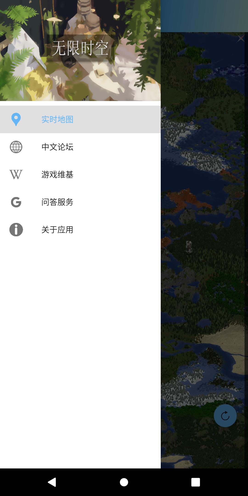
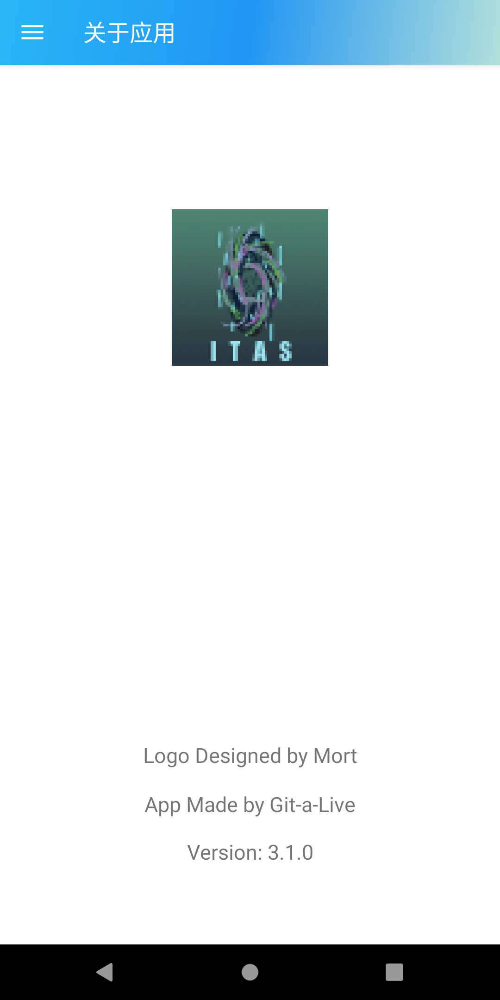
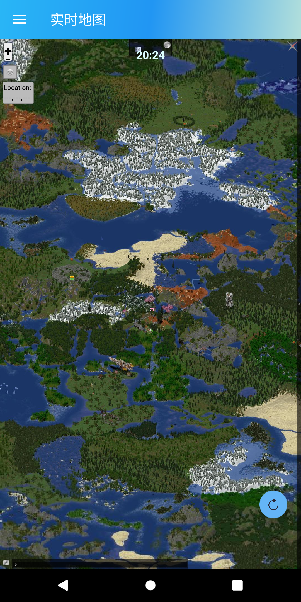
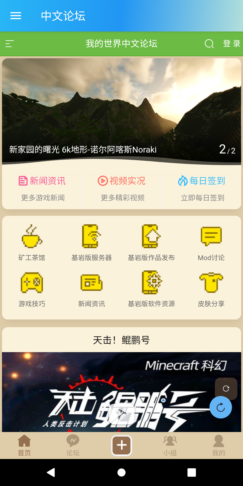
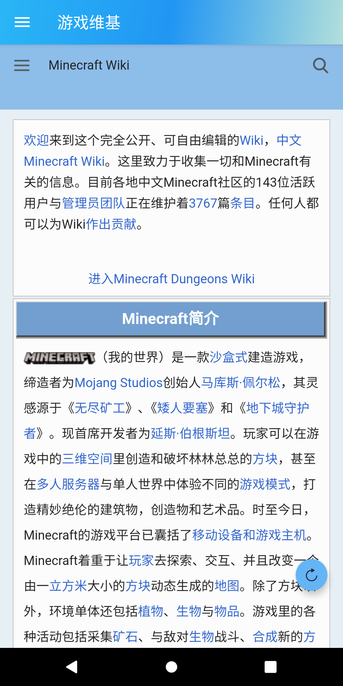
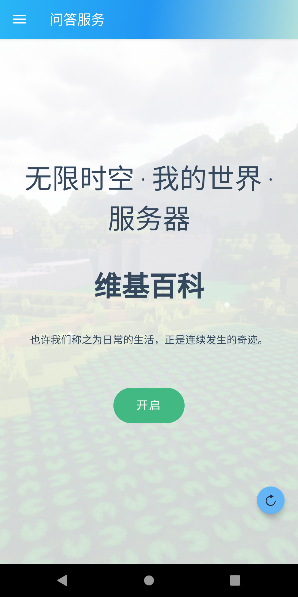

# ISaT Service App

An Android application developed for Minecraft Server *Infinite Space and Time*(无限时空)

## Preview

  

## Features

>Attention: this application needs one permission only to access internet

+ **Real Time Map**

A real time map that indicates online players, terrains and buildings built by players. Users can chat with online players by typing in the dialog box at the bottom of the map. This map can be zoomed in or zoomed out with users' gestures. Also, a floating action button is made use of refreshing the map and clearing the cache (sometimes the map will stuck after updating the server).

+ **MC BBS**

A Chinese Minecraft BBS run by a group of Minecraft fans. Many players browse this site for sharing and learning. Our administrator of Server ISaT owns an account and posted an article on the site for promotion.

+ **Minecraft Wiki**

A Chinese Minecraft Wiki that introduces almost everthing about Minecraft. 

+ **FAQ Service**

A website based on docsify and GitHub Pages that provides a serials of FAQs about Server ISaT. It is built by Git-a-Live and another administrator -- neverlag, and contains many contents such as rules of the server, installation of JRE, plugins and commands, etc.

