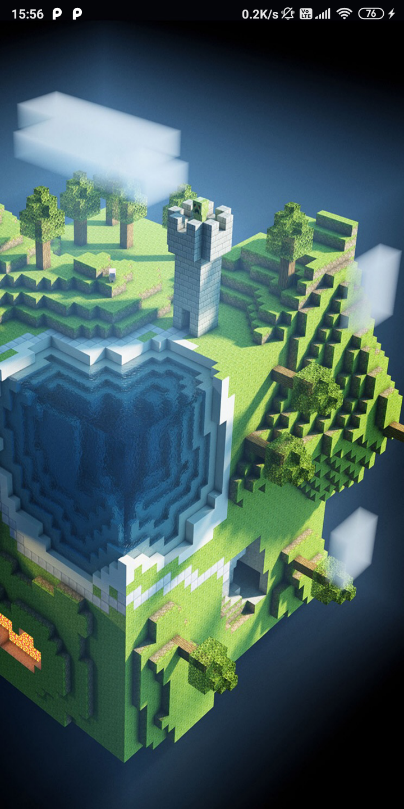
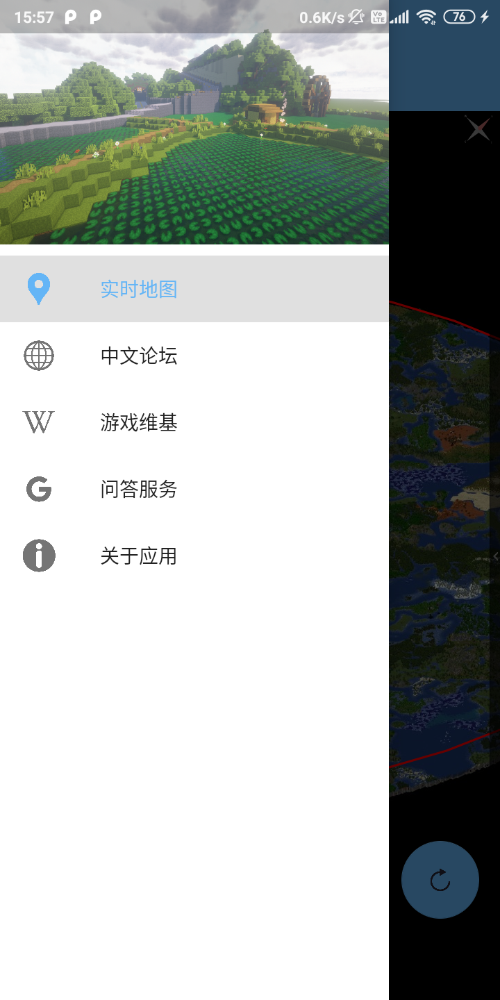
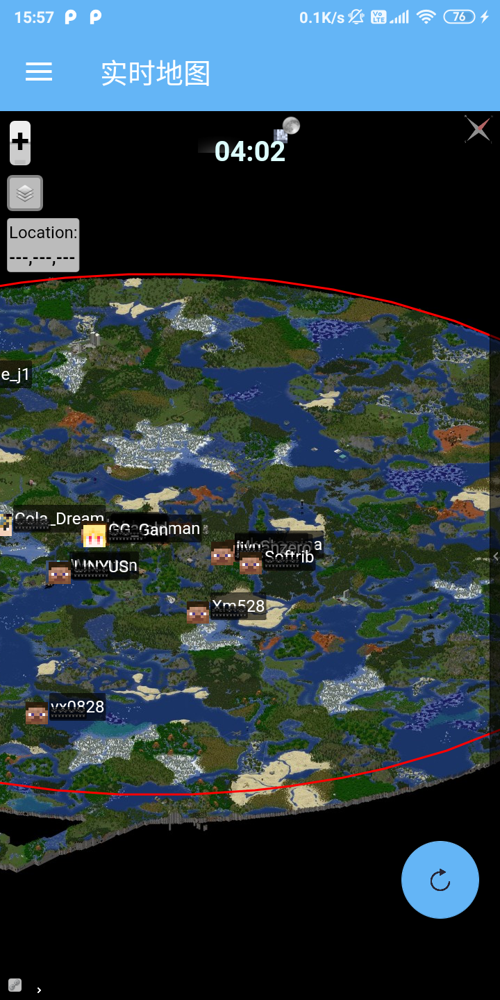
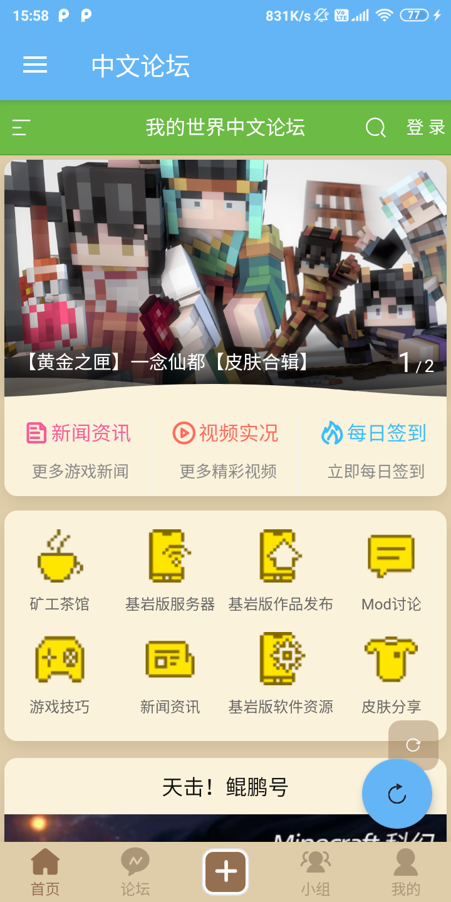
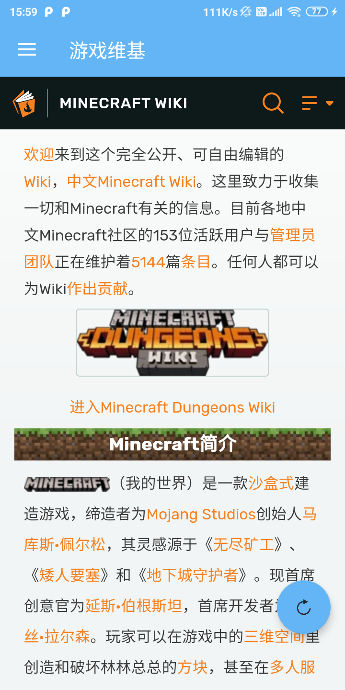
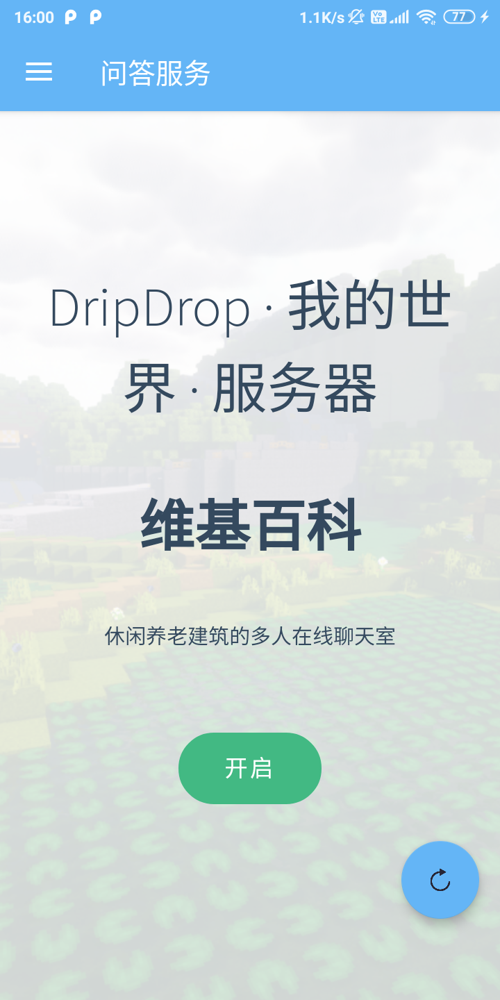
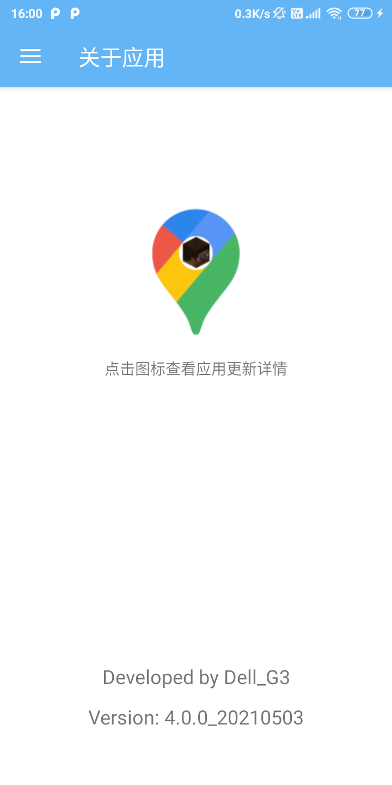
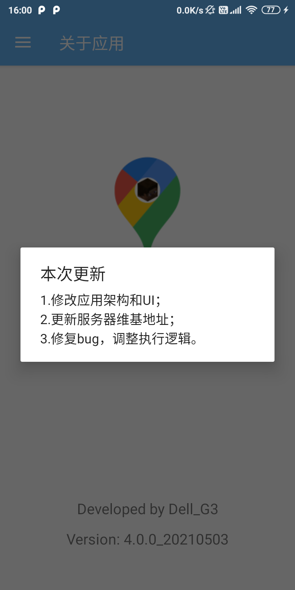

# DripDrop Service App

An Android application developed for Minecraft Server *DripDrop*

## Preview

 

## Features

>Attention: All this application needs is one permission to access internet only.

+ **Real Time Map**

A real time map that indicates online players, terrains and buildings built by players. Users can chat with online players by typing in the dialog box at the bottom of the map if they would like to tap the tiny bar. This map can be zoomed in or zoomed out with users' gestures. 

Also, a floating action button is designed for refreshing the web with a short click or clearing the cache and returning to the home page with a long click. It takes effect to all fragments that contains WebView.

+ **MC BBS**

A Chinese Minecraft BBS run by a group of Minecraft fans. Many players browse this site for sharing and learning. Our administrator of DripDrop owns an account and posted an article on the site for promotion.

+ **Minecraft Wiki**

A Chinese Minecraft Wiki that introduces almost everthing about Minecraft. 

+ **FAQ Service**

A website based on docsify and GitHub Pages that provides a serials of FAQs about DripDrop. It is built by me and neverlag -- the administrator of DripDrop, and contains many contents such as rules of the server, installation of JRE, plugins and commands, etc.

+ **Other**

Go to "About" (关于应用) and you can learn about the
version and developer of this application. Of course, if you tap the logo, a dialog will pop up and show you what's new on this version.

 